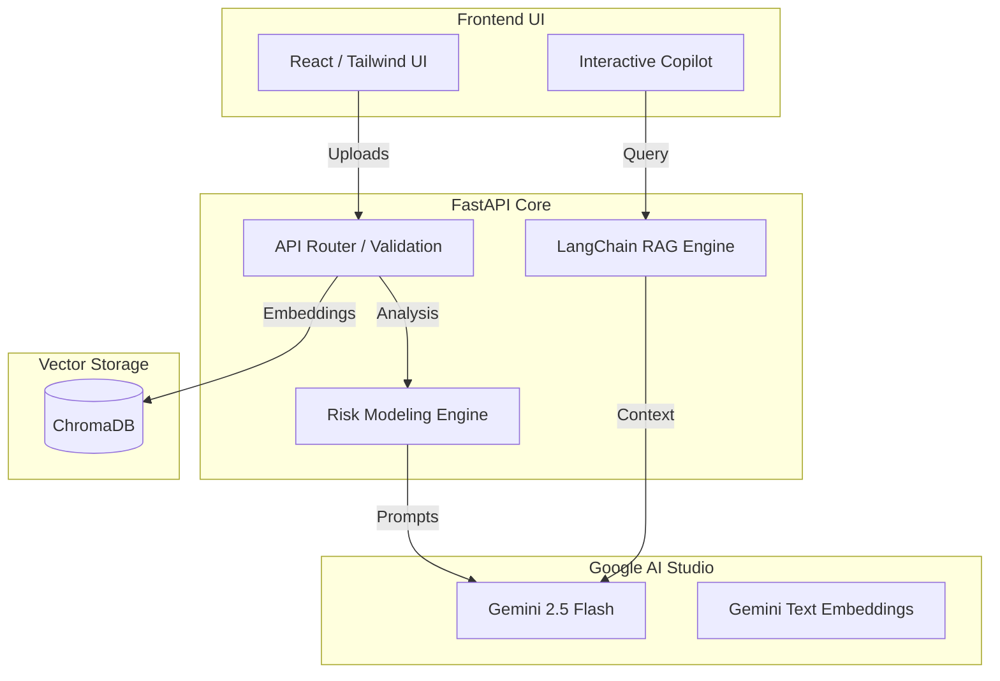

# ⚖️ LexAI - Legal Intelligence

  <h3>Decode contracts in seconds, not hours.</h3>
  
Built for the <b>AI for Legal Assistance & Access Challenge</b>

---

## 🎯 Chosen Vertical
**AI for Legal Assistance & Access**
We built this solution specifically for individuals, freelancers, and small businesses who cannot afford expensive legal counsel. Our vertical focuses on democratizing legal knowledge by making dense, predatory contracts easy to understand and immediately actionable.

## 🧠 Approach and Logic
Our approach bridges advanced Generative AI with a strictly typed, secure backend. The logic follows a multi-stage pipeline:
1. **Ingestion & Sanitization:** Documents are parsed using magic-byte validation to prevent malicious uploads, and text is extracted securely.
2. **Semantic Chunking:** Long legal documents are split into overlapping chunks to preserve legal context without exceeding LLM context windows.
3. **Parallel LLM Processing:** We use **Google Gemini 2.5 Flash** to run Document Simplification (Plain English) and Risk Modeling (Critical/High/Medium flags) concurrently to reduce latency.
4. **Vector Retrieval (RAG):** Document chunks are embedded using **Gemini Text Embeddings** and stored in an in-memory **ChromaDB** instance. When a user asks the Copilot a question, we retrieve the top-K most relevant clauses and ground the AI's response in the exact contract text.

## ⚙️ How the Solution Works
1. A user uploads an NDA, Employment Contract, or Terms of Service (PDF/DOCX/TXT).
2. The FastAPI backend extracts the text, runs security sanitization, and processes it via the Gemini 2.5 Flash model.
3. The React frontend receives a structured JSON payload containing the Plain English translation and Risk Cards.
4. The user interacts with the RAG-powered Copilot via a streaming chat interface to ask specific questions about their obligations.

## 🤔 Assumptions Made
* **Document Scope:** Assumes uploaded documents are text-based legal contracts (PDF, DOCX, TXT) and not scanned images requiring OCR.
* **Jurisdiction:** Risk analysis is based on generalized common law principles (e.g., standard definitions of perpetual liability and non-compete reasonableness) rather than state-specific statutes.
* **LLM Consistency:** Assumes the Gemini model will return properly formatted JSON based on our strict prompt engineering and Pydantic schemas.

---

## 🚀 Optimization & Efficiency (Score Focus)
* **Asynchronous I/O (Backend):** The FastAPI backend utilizes 100% `async/await` for all Gemini API calls and file operations, preventing thread blocking during heavy LLM generation.
* **Memoization & Caching (Frontend):** React components are wrapped in `React.memo` and expensive functions use `useMemo`/`useCallback` to prevent unnecessary re-renders.
* **Resource Pooling (Database):** ChromaDB is instantiated as a singleton at application startup, avoiding expensive database connection teardowns on every request.
* **Streaming Responses:** The RAG Copilot uses Server-Sent Events (SSE) to stream tokens to the frontend, drastically reducing time-to-first-byte (TTFB) and perceived latency.

## 🛡️ Security & Accessibility
* **Security:** Implemented `slowapi` rate limiting to prevent API abuse, and rigorous sanitization to prevent prompt injection attacks.
* **Accessibility:** The frontend utilizes semantic HTML5 (`<main>`, `<section>`), fully compliant ARIA labels (`aria-live`, `aria-label`), keyboard navigability (`tabIndex`), and WCAG compliant color contrast ratios for visually impaired users.

## 🧪 Testing Strategy
* **Unit Testing:** Comprehensive coverage using `pytest` and `pytest-asyncio` for core logic (sanitizer, extractors).
* **Integration Testing:** FastAPI `TestClient` routes to ensure contract responses meet Pydantic schemas.

---

## 🏗️ System Architecture

