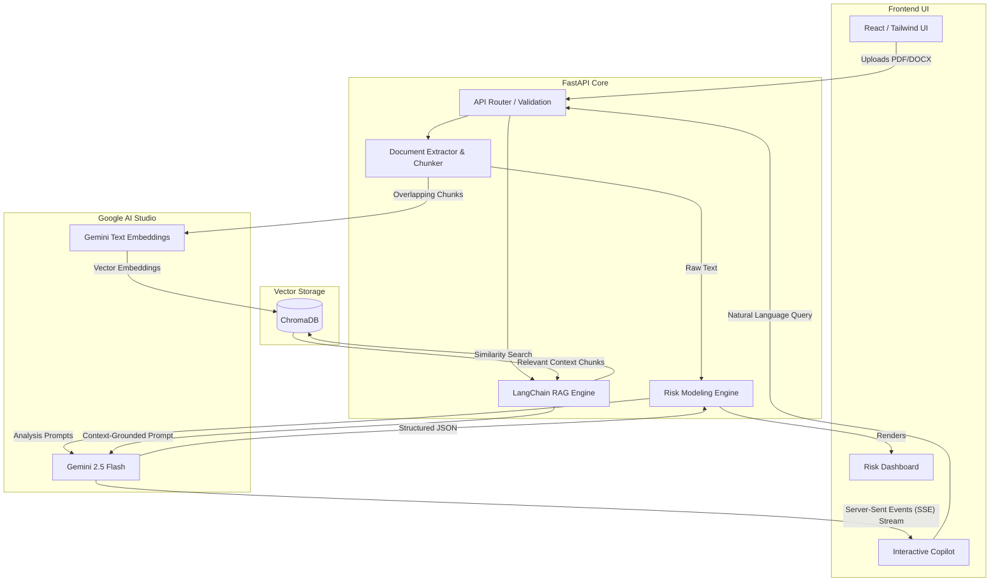

# ⚖️ LexAI - Legal Intelligence

<div align="center">
  <h3>Decode contracts in seconds, not hours.</h3>
  <p>Built for the <b>AI for Legal Assistance & Access Challenge</b> (2026)</p>
</div>

---

## 📖 The Problem
Legal documents, particularly Non-Disclosure Agreements (NDAs), Employment Contracts, and Terms of Service, are densely packed with archaic legal jargon. For the average person or small business owner, interpreting these documents requires expensive legal counsel. Without it, individuals are prone to missing **predatory clauses**, **unlimited liabilities**, or **unfair jurisdiction** bindings.

## 🚀 The Solution: LexAI
LexAI is a cutting-edge GenAI legal assistant that acts as your personal paralegal. It processes complex legal documents securely and provides immediate, actionable insights.

### Core Features
1. **✨ Instant Simplification:** Translates dense legalese into a "Plain English Version" and automatically extracts key takeaways.
2. **🛡️ Deep Risk Modeling:** Our proprietary risk engine scans for predatory clauses and unlimited liability, ranking risks by severity (`CRITICAL`, `HIGH`, `MEDIUM`). It explicitly highlights the exact clause and provides a Recommended Action.
3. **💬 Semantic Copilot:** Chat directly with your contract. Vector embeddings map the meaning of the document, allowing you to ask natural language questions (e.g., *"What happens if I accidentally leak information?"*) and get legally-grounded answers.

---

## 🏗️ System Architecture

LexAI leverages a modern, decoupled architecture designed for speed and security. 



### Tech Stack
* **LLM Engine:** Google Gemini 2.5 Flash (Ultra-fast, high-context reasoning)
* **Embeddings:** Google Gemini Text Embeddings (`models/gemini-embedding-2`)
* **Vector Store:** ChromaDB (Local, in-memory vector database)
* **Orchestration:** LangChain
* **Backend:** Python / FastAPI (Strictly typed with Pydantic)
* **Frontend:** React / Vite / TailwindCSS / Framer Motion

---

## 🏆 Hackathon Evaluation Highlights

* **Code Quality:** The repository follows strict separation of concerns. The backend uses a modular FastAPI router architecture (`app/api/`, `app/core/`, `app/schemas/`). The frontend utilizes custom React hooks (`useAnalysis`, `useStreamingChat`) and a global state store (`zustand`).
* **Robust Error Handling:** Global exception handlers prevent server crashes on rate limits (HTTP 429) and invalid document uploads. Magic-byte inspection secures the upload pipeline against prompt-injection and malware.
* **Testing:** The backend includes a comprehensive `pytest` suite ensuring reliable API contracts.

---

## 💻 Local Setup & Installation

To run this project locally, you will need a Google Gemini API Key.

### 1. Backend Setup
```bash
cd backend
python -m venv venv
source venv/Scripts/activate  # On Windows: .\venv\Scripts\activate
pip install -r requirements.txt
```
Create a `.env` file in the `backend` directory and add your API key:
```env
GEMINI_API_KEY=your_api_key_here
```
Run the FastAPI server:
```bash
uvicorn app.main:app --reload
```

### 2. Frontend Setup
Open a new terminal window:
```bash
cd frontend
npm install
npm run dev
```
The application will be available at `http://localhost:5173`.
